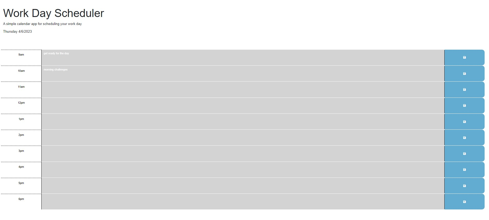

# 05-daily-planner

https://michellebaker1129.github.io/05-daily-planner/

https://github.com/michellebaker1129/05-daily-planner 

## I'm unemployed!

Thank goodness I am enrolled in the UC Berkeley coding boot camp, which will help me land the perfect job. Already I've learned how to make an online quiz for myself. I will continue to update this page as I learn new things, but already I have so many mad skills to show off. 

# code-quiz

As a coding boot camp student, I want to make a timed quiz on JavaScript fundamentals and keep track of my scores as I practice. This way I can see where I need to spend more time stydying. 

When I click the start button on my code quiz a timer will start and I will be presented with my first question. When I answer a question right, any time I have left on the countdown will be my score. When I answer wrong, my score will decrease by 2 points. If I don't answer at all I will get 0 points. When I am done I can save my initials and my score on a leaderboard. 

## What I did

- Created an object to handle high scores
  - Read from localStorage on page load to check for any existing scores
  - Updated localStorage with current user score
  - Prompted the user to enter initials and store into localStorage
- Created an object that updates the DOM with which stage of the quiz we're on (intro, quiz, end)
- Created an object that handles quiz questions
  - Replaced the prev question markup with current question markup
  - Handled answers with correct or incorrect/notify the user
  - Handled updating score
  - Handled timer
  - Built out the markup for individual questions

# Fun New Learnings
- string literal (vs template literal) 
- string interpolation
- TODO 

## Technology Used
* HTML
* CSS
* GitHub
* JSON

## References & Resources

I relied heavily on 
* W3Schools Online Web Tutorials https://www.w3schools.com
* MDN Web Docshttps://developer.mozilla.org
* Introducing JSON https://www.json.org/json-en.html 
* Mosh Hamedani https://codewithmosh.com/

## Credits

I've learned everything I know from 
* Berkeley Coding Boot Camp https://bootcamp.berkeley.edu/codingbootcamp/officialsite  

## License

[LISCENSE.md](LISCENSE.md)

MIT License

Copyright (c) [2023] [TiaBakerBrown]

Permission is hereby granted, free of charge, to any person obtaining a copy
of this software and associated documentation files (the "Software"), to deal
in the Software without restriction, including without limitation the rights
to use, copy, modify, merge, publish, distribute, sublicense, and/or sell
copies of the Software, and to permit persons to whom the Software is
furnished to do so, subject to the following conditions:

The above copyright notice and this permission notice shall be included in all
copies or substantial portions of the Software.

THE SOFTWARE IS PROVIDED "AS IS", WITHOUT WARRANTY OF ANY KIND, EXPRESS OR
IMPLIED, INCLUDING BUT NOT LIMITED TO THE WARRANTIES OF MERCHANTABILITY,
FITNESS FOR A PARTICULAR PURPOSE AND NONINFRINGEMENT. IN NO EVENT SHALL THE
AUTHORS OR COPYRIGHT HOLDERS BE LIABLE FOR ANY CLAIM, DAMAGES OR OTHER
LIABILITY, WHETHER IN AN ACTION OF CONTRACT, TORT OR OTHERWISE, ARISING FROM,
OUT OF OR IN CONNECTION WITH THE SOFTWARE OR THE USE OR OTHER DEALINGS IN THE
SOFTWARE.

User Story
AS AN employee with a busy schedule
I WANT to add important events to a daily planner
SO THAT I can manage my time effectively

Acceptance Criteria
GIVEN I am using a daily planner to create a schedule
WHEN I open the planner
THEN the current day is displayed at the top of the calendar
WHEN I scroll down
THEN I am presented with time blocks for standard business hours
WHEN I view the time blocks for that day
THEN each time block is color-coded to indicate whether it is in the past, present, or future
WHEN I click into a time block
THEN I can enter an event
WHEN I click the save button for that time block
THEN the text for that event is saved in local storage
WHEN I refresh the page
THEN the saved events persist

It is your responsibility to include a note in the README section of your repo specifying code source and its location within your repo. This applies if you have worked with a peer on an assignment, used code in which you did not author or create sourced from a forum such as Stack Overflow, or you received code outside curriculum content from support staff such as an Instructor, TA, Tutor, or Learning Assistant. This will provide visibility to grading staff of your circumstance in order to avoid flagging your work as plagiarized.

If you are struggling with a Challenge or any aspect of the curriculum, please remember that there are student support services available for you:

Office hours facilitated by your TA(s)

Tutor sessions (sign upLinks to an external site.)

Ask the class Slack channel/get peer support

AskBCS Learning Assistants